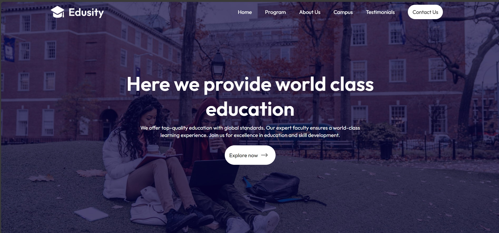
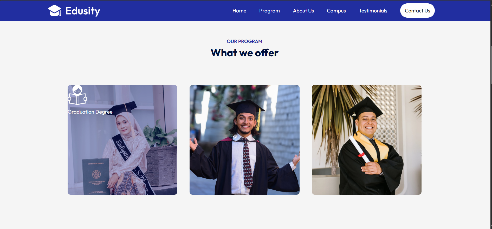
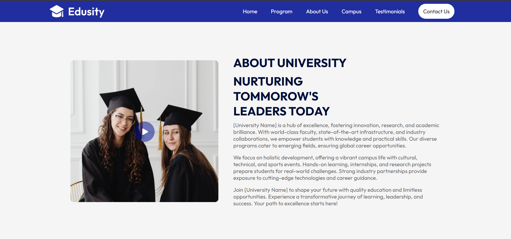
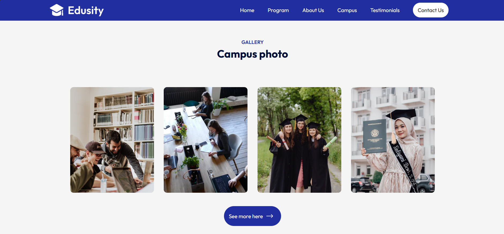
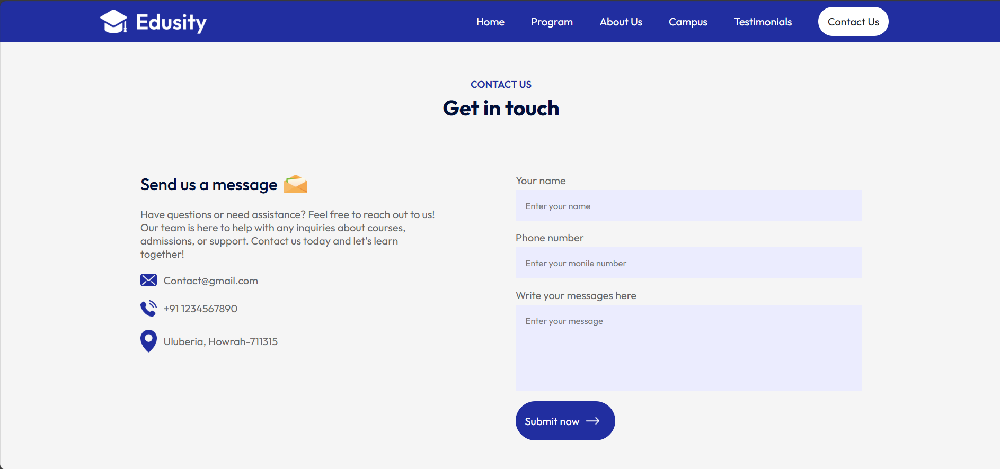

# 🎓 EduWorld – College Website Clone

A modern, responsive college website clone built using React.js, HTML5, and CSS3. Featuring smooth navigation, interactive components, and an elegant UI, this project simulates a real-world college site with multiple pages and responsive design breakpoints.


## 🌐 Live Preview
🔗 View Live Project
https://edu-world-mu.vercel.app/


## ✨ Features
-📄**Multi-Page UI** – Includes Home, Programs, Campus Life, Testimonials, and Contact pages

-📱 **Responsive Design** – Fully optimized for desktop, tablet (850px), and mobile (650px) views

-⚛️ **Reusable Components** – Built with modular functional components using props and hooks

-🧠 **State Management** – Efficient and scalable UI handled with React state and logic

-📝 **Interactive Form** – “Get in Touch” contact form with front-end validation and UX-friendly input handling

-🎨 **Clean Layouts** – Smooth transitions and organized structure for a modern experience


## 🛠️ Tech Stack
**Frontend:** React.js, HTML5, CSS3
**Development Tools:** React Hooks, Props, Create React App


## 🚀 Quick Start

### Prerequisites
- Node.js (v14+)
- npm or yarn

### Installation 

1. **Clone the repository**
   ```bash
   git clone https://github.com/yourusername/eduworld-college-clone.git
   cd eduworld-college-clone
   ```

2. **Install dependencies**
   ```bash
   npm install
   ```

3. **Start the development server**
   ```bash
   npm start
   🖥️ Open your browser at http://localhost:3000
   ```

### 📸 Screenshots

| 📌 Page | Desktop View | 
|------|------------|
| **HOME** |  | 
| **PROGRAMS** |  | 
| **ABOUT US** |  | 
| **CAMPUS** |  | 
| **TESTIMONIALS** |  | 
| **CONTACTUS** |  | 


## 🔮 Future Enhancements
 
 - [ ] Add animations using Framer Motion or GSAP
 - [ ] Backend integration for contact form (Node.js or Firebase)
 - [ ] Admin panel for updating testimonials or program info
 - [ ] SEO optimization for better indexing
 - [ ] Dark/Light mode toggle


## 💡 Learnings

- [ ] Building multi-page navigation in SPA using React
- [ ] Handling responsive breakpoints and layout shifts
- [ ] Real-world form UX and validation best practices


**📣 Show Some Love**
**If you like this project, please ⭐️ the repository to support and share it with others.**
**Made with ❤️**
